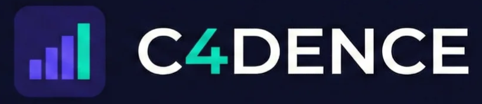
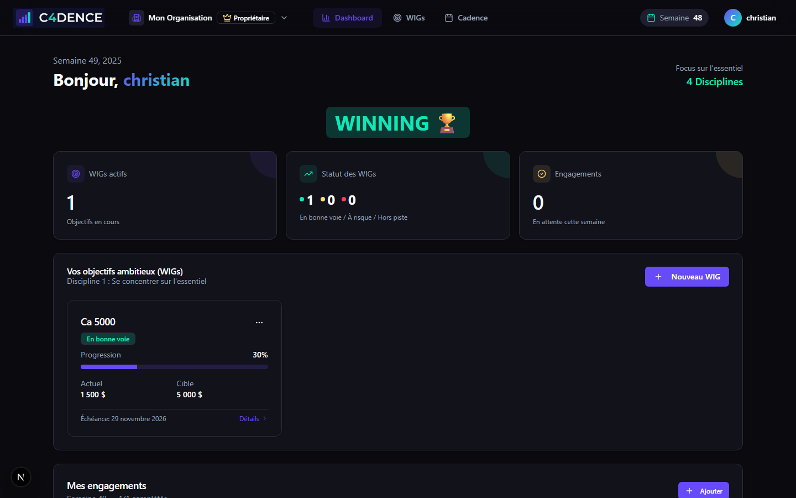
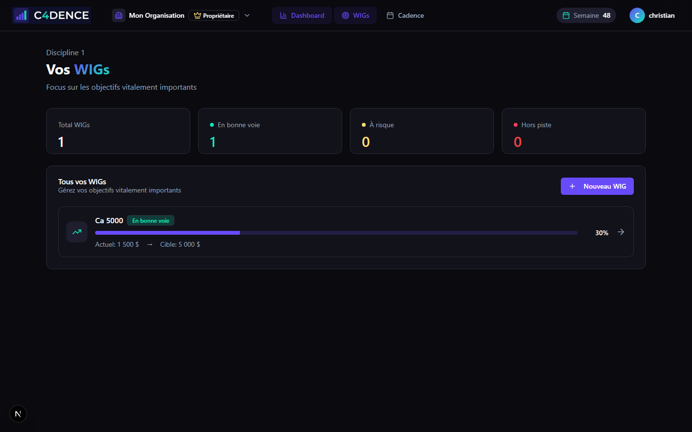
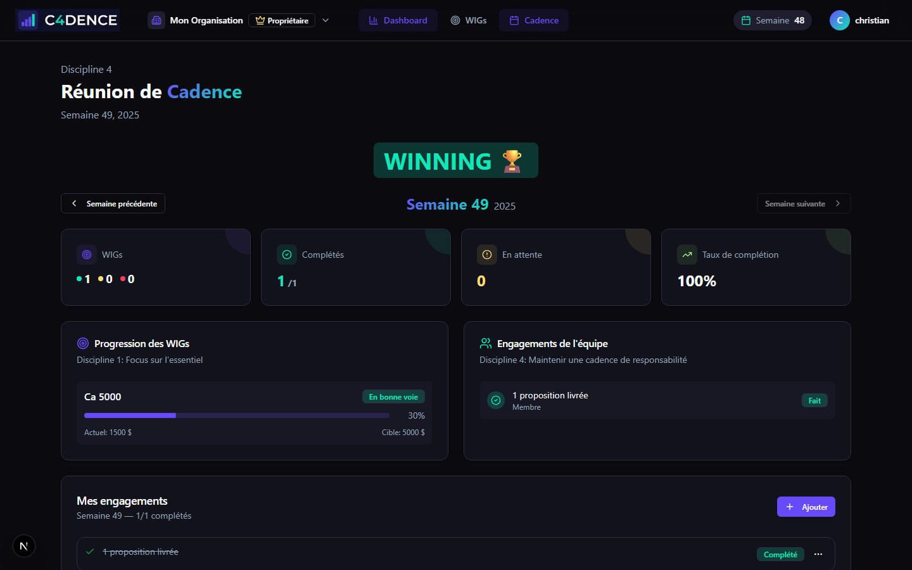
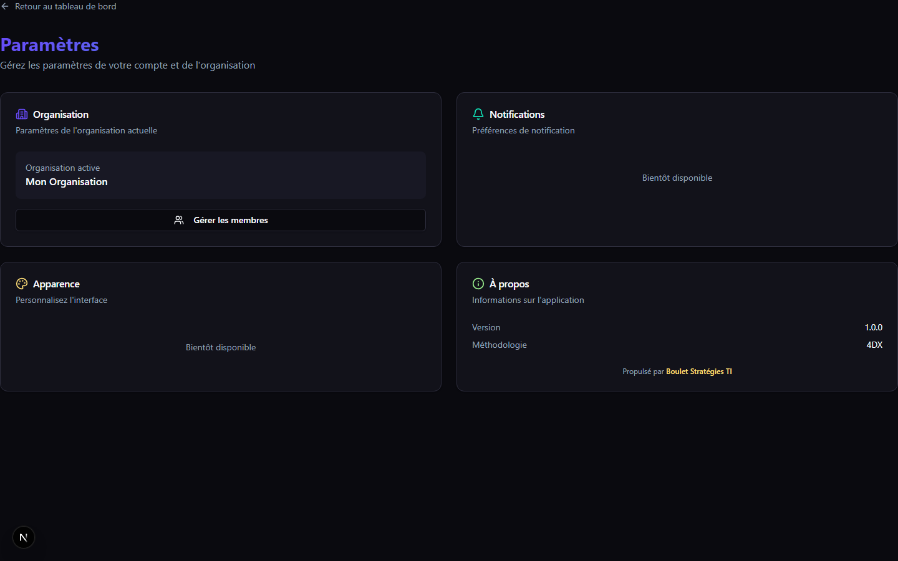
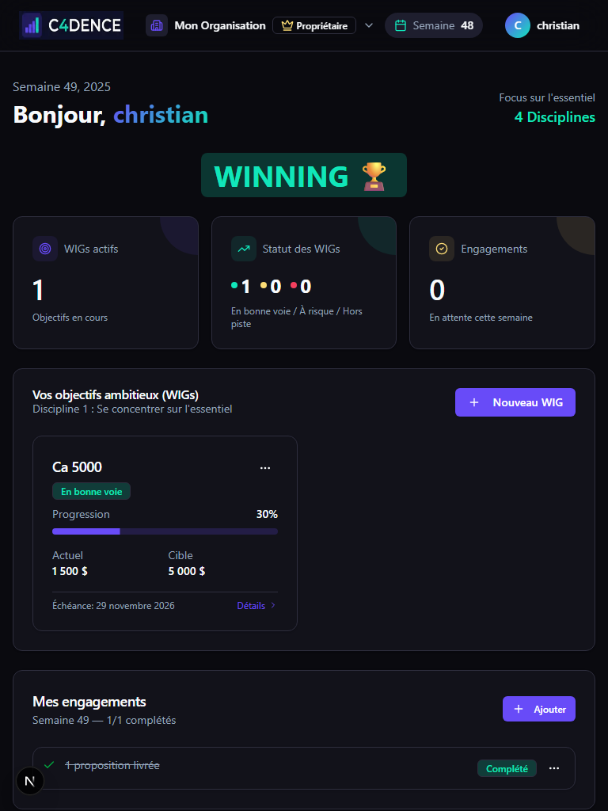

<p align="center">
  
</p>

<p align="center">
  <strong>Plateforme d'exécution stratégique basée sur les 4 Disciplines de l'Exécution</strong>
</p>

<p align="center">
  <a href="https://c4dence.bouletstrategies.ca">Live Demo</a> •
  <a href="docs/guide-utilisateur.md">Guide Utilisateur</a> •
  <a href="docs/methodologie-4dx.md">Méthodologie 4DX</a> •
  <a href="docs/guide-admin.md">Guide Admin</a>
</p>

<p align="center">
  
  
  
  
  
</p>

---

<p align="center">
  
</p>

---

## Vue d'ensemble

**C4DENCE** transforme vos objectifs stratégiques en résultats mesurables grâce à la méthodologie **4DX** (4 Disciplines of Execution) de FranklinCovey.

> *"80% des stratégies échouent non pas à cause d'une mauvaise stratégie, mais d'une mauvaise exécution."*

### Pourquoi C4DENCE?

| Problème | Solution C4DENCE |
|----------|------------------|
| Trop d'objectifs = aucun focus | **Discipline 1** : Focus sur 2-3 WIGs essentiels |
| On mesure les résultats trop tard | **Discipline 2** : Lead Measures prédictives |
| L'équipe ne sait pas si elle gagne | **Discipline 3** : Scoreboard visuel et clair |
| Les urgences prennent le dessus | **Discipline 4** : Cadence hebdomadaire sacrée |

---

## Fonctionnalités

### WIGs (Wildly Important Goals)
- Format "De X à Y d'ici [date]"
- Progression visuelle avec indicateur WINNING/LOSING
- Statuts automatiques : En bonne voie / À risque / Hors piste
- Attribution de responsable

### Lead Measures (Mesures Prédictives)
- Actions hebdomadaires mesurables
- Cibles par semaine configurables
- Tendances avec flèches directionnelles
- Charts de performance

### Scoreboard (Tableau de Bord)
- Dashboard avec KPIs temps réel
- Charts Tremor pour visualisations
- Progression WIG vs trajectoire idéale
- Indicateur WINNING/LOSING prominent

### Cadence (Responsabilité)
- Page de réunion dédiée avec timer
- Navigation par semaine
- Engagements par membre
- Gestion des obstacles
- Agenda structuré en 5 étapes

### Multi-Tenant
- Organisations isolées
- Invitations par email (via Resend)
- Rôles : Propriétaire > Admin > Membre
- Sélecteur d'organisation

### Authentification
- Google OAuth (comptes personnels et Workspace)
- Microsoft 365 OAuth (multi-tenant Azure AD)
- Connexion SSO pour entreprises

### Super Admin
- Module d'administration réservé à l'opérateur
- Gestion de toutes les organisations (CRUD)
- Activation/désactivation d'organisations
- Envoi d'invitations administratives
- Vue globale des utilisateurs

---

## Stack Technique

| Technologie | Usage |
|------------|-------|
| **Next.js 16** | Framework React avec App Router |
| **React 19** | Interface utilisateur |
| **TypeScript** | Typage statique |
| **Tailwind CSS 4** | Styling utility-first |
| **Prisma 7** | ORM avec adapter pattern |
| **Supabase** | Auth (Google + Microsoft OAuth) + PostgreSQL |
| **Tremor** | Charts et visualisations |
| **shadcn/ui** | Composants UI accessibles |
| **Resend** | Emails transactionnels |

---

## Démarrage Rapide

### Prérequis

- Node.js 20+
- Compte Supabase
- Credentials Google OAuth
- Compte Resend (pour les emails)

### Installation

```bash
# Cloner le repo
git clone https://github.com/BouletStrategies/c4dence.git
cd c4dence

# Installer les dépendances
npm install

# Configurer les variables d'environnement
cp .env.example .env.local
```

### Configuration

```env
# Supabase
NEXT_PUBLIC_SUPABASE_URL=your_supabase_url
NEXT_PUBLIC_SUPABASE_ANON_KEY=your_anon_key

# Database (Supavisor pooler)
DATABASE_URL=postgresql://...?pgbouncer=true
DIRECT_URL=postgresql://...

# Resend (emails)
RESEND_API_KEY=re_xxxxx
EMAIL_FROM="C4dence <noreply@yourdomain.com>"

# App URL
NEXT_PUBLIC_APP_URL=http://localhost:3000
```

### Base de données

```bash
# Générer le client Prisma
npx prisma generate

# Pousser le schéma
npx prisma db push
```

### Développement

```bash
npm run dev
```

Ouvrir [http://localhost:3000](http://localhost:3000)

---

## Documentation

| Document | Description | Audience |
|----------|-------------|----------|
| [Guide Utilisateur](docs/guide-utilisateur.md) | Prise en main complète | Tous les utilisateurs |
| [Méthodologie 4DX](docs/methodologie-4dx.md) | Comprendre les 4 disciplines | Leaders, Managers |
| [Guide Administrateur](docs/guide-admin.md) | Configuration et gestion | Admins, Owners |

---

## Structure du Projet

```
src/
├── app/                    # Next.js App Router
│   ├── (auth)/            # Routes authentification
│   │   ├── login/         # Connexion Google/Microsoft OAuth
│   │   ├── callback/      # OAuth callback
│   │   ├── onboarding/    # Création première org
│   │   └── invite/[token] # Acceptation invitation
│   ├── admin/             # Super Admin (accès restreint)
│   │   ├── page.tsx       # Liste organisations
│   │   ├── organizations/ # Détail organisation
│   │   └── users/         # Liste utilisateurs
│   ├── dashboard/         # Routes protégées
│   │   ├── page.tsx       # Dashboard principal
│   │   ├── wigs/          # Liste et détail WIGs
│   │   ├── cadence/       # Réunion de cadence
│   │   ├── members/       # Gestion membres
│   │   └── settings/      # Paramètres organisation
│   └── actions/           # Server Actions
├── components/
│   ├── ui/                # shadcn/ui
│   ├── providers/         # React Context
│   ├── layout/            # Header, navigation
│   ├── wig/               # Composants WIG
│   ├── lead-measure/      # Lead Measures
│   ├── engagement/        # Engagements
│   ├── cadence/           # Cadence meeting
│   └── charts/            # Tremor charts
├── lib/                   # Utilitaires
│   ├── prisma.ts          # Client Prisma
│   ├── supabase/          # Clients Supabase
│   ├── email.ts           # Service Resend
│   ├── permissions.ts     # Matrice permissions
│   └── week.ts            # Utilitaires semaine ISO
└── types/                 # Types TypeScript
```

---

## Design System

### Couleurs

| Couleur | Hex | Usage |
|---------|-----|-------|
| Purple | `#684bf8` | Primaire, actions |
| Cyan | `#11e6ba` | Success, On-track |
| Gold | `#fcdc76` | Warning, At-risk |
| Lime | `#9bef8e` | Success secondaire |

### Statuts WIG

| Statut | Couleur | Condition |
|--------|---------|-----------|
| En bonne voie | Cyan | Progression >= 90% attendu |
| À risque | Gold | Progression 70-90% |
| Hors piste | Rouge | Progression < 70% |
| Atteint | Or | Objectif complété |

---

## Screenshots

<details>
<summary>Voir toutes les captures d'écran</summary>

### Login


### Dashboard


### Liste des WIGs


### Page Cadence


### Gestion des Membres


### Paramètres


</details>

---

## Responsive

C4DENCE s'adapte à tous les écrans :

| Desktop (1440px) | Tablet (768px) | Mobile (375px) |
|------------------|----------------|----------------|
|  |  |  |

---

## Roadmap

- [x] WIGs avec progression
- [x] Lead Measures hebdomadaires
- [x] Scoreboard avec charts
- [x] Cadence meeting
- [x] Multi-tenant avec invitations
- [x] Emails d'invitation (Resend)
- [x] Microsoft 365 OAuth (multi-tenant)
- [x] Module Super Admin
- [ ] Export PDF des rapports
- [ ] Notifications (rappels cadence)
- [ ] Intégration calendrier
- [ ] API publique

---

## Contribuer

Les contributions sont les bienvenues!

1. Fork le projet
2. Créer une branche (`git checkout -b feature/AmazingFeature`)
3. Commit (`git commit -m 'Add AmazingFeature'`)
4. Push (`git push origin feature/AmazingFeature`)
5. Ouvrir une Pull Request

---

## Support

- **Email** : support@bouletstrategies.ca
- **Documentation** : [docs/](docs/)

---

## License

MIT © [Boulet Stratégies TI](https://bouletstrategies.ca)

---

<p align="center">
  
</p>

<p align="center">
  <sub>Construit avec passion par <a href="https://bouletstrategies.ca">Boulet Stratégies TI</a></sub>
</p>
