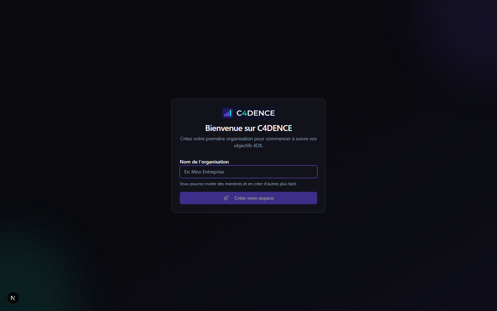

# Guide Utilisateur C4DENCE

> **Exécutez votre stratégie avec discipline**

---

## Bienvenue dans C4DENCE

C4DENCE est votre plateforme d'exécution stratégique basée sur la **Méthode C4DENCE** — une méthodologie éprouvée d'exécution en 4 piliers. Elle vous aide à transformer vos objectifs ambitieux en résultats concrets grâce à un système de focus, de mesure et de responsabilisation.

### Ce que C4DENCE vous permet de faire

- **Définir** vos Objectifs Prioritaires (OP)
- **Mesurer** les Indicateurs Prédictifs qui mènent au succès
- **Visualiser** votre progression en temps réel
- **Maintenir** un rythme de synchronisation avec votre équipe

### Connexion

C4DENCE utilise la connexion sécurisée via Google ou Microsoft 365. Cliquez simplement sur **"Continuer avec Google"** ou **"Continuer avec Microsoft"** et utilisez votre compte professionnel.

---

## Premiers pas (5 minutes)

### Créer votre organisation

Lors de votre première connexion, vous serez invité à créer votre organisation :

1. Entrez le **nom de votre entreprise**
2. Cliquez sur **Créer**
3. Vous devenez automatiquement **Propriétaire** de l'organisation

### Inviter votre équipe

Pour exécuter une stratégie, vous avez besoin de votre équipe :

1. Allez dans **Membres** depuis le menu
2. Cliquez sur **Inviter un membre**
3. Entrez l'adresse email du collègue
4. Choisissez son rôle (Membre ou Administrateur)
5. L'invitation est envoyée par email

### Comprendre le tableau de bord

Votre tableau de bord affiche en un coup d'oeil :

- **Semaine actuelle** — Le numéro de semaine et la date
- **Statut VICTOIRE/DANGER** — Êtes-vous en train de gagner?
- **Vos Objectifs Prioritaires actifs** — Les objectifs en cours
- **Vos engagements** — Ce que vous avez promis cette semaine

---

## Les 4 Piliers en action

### Pilier 1 : Définir vos Objectifs Prioritaires (OP)

#### Qu'est-ce qu'un Objectif Prioritaire?

Un **Objectif Prioritaire (OP)** est un objectif tellement important que si vous ne l'atteignez pas, rien d'autre n'a vraiment d'importance. Ce n'est pas un objectif ordinaire — c'est L'OBJECTIF qui change la donne.

#### Comment créer un bon Objectif Prioritaire

Un OP efficace suit le format **"De X à Y d'ici [date]"** :

| Mauvais OP | Bon OP |
|------------|--------|
| "Augmenter les ventes" | "Augmenter les ventes B2B de 2.5M$ à 3.2M$ d'ici le 31 mars 2026" |
| "Améliorer la qualité" | "Réduire le taux de retour de 8% à 3% d'ici le 30 juin 2026" |
| "Satisfaire les clients" | "Augmenter le NPS de 32 à 50 d'ici décembre 2025" |

#### Créer un Objectif Prioritaire dans C4DENCE

1. Depuis le tableau de bord, cliquez sur **+ Nouvel Objectif**
2. Donnez un **nom clair** à votre objectif
3. Définissez la **valeur de départ** (où vous êtes aujourd'hui)
4. Définissez la **valeur cible** (où vous voulez aller)
5. Choisissez l'**unité** ($, %, nombre, etc.)
6. Fixez la **date d'échéance**
7. Assignez un **propriétaire**

#### Pourquoi se limiter à 2-3 Objectifs Prioritaires

> *"Si vous avez plus de 3 priorités, vous n'en avez aucune."*

La recherche montre que la probabilité d'atteindre vos objectifs **diminue drastiquement** avec le nombre d'objectifs :

- 2-3 Objectifs → 100% de chances d'excellence
- 4-10 Objectifs → 1-2 atteints avec excellence
- 11+ Objectifs → Aucun atteint avec excellence

C4DENCE vous encourage à **faire moins, mais mieux**.

---

### Pilier 2 : Indicateurs Prédictifs (IP)

#### Indicateur de Résultat vs Indicateur Prédictif

| Type | Définition | Exemple | Quand on le sait |
|------|------------|---------|------------------|
| **Indicateur de Résultat (IR)** | Le résultat final | Ventes mensuelles | Après coup |
| **Indicateur Prédictif (IP)** | L'action qui influence le résultat | Appels de prospection | En temps réel |

Votre Objectif Prioritaire est un **Indicateur de Résultat** — vous ne pouvez pas le changer directement.

Les **Indicateurs Prédictifs** sont les actions que vous contrôlez et qui **prédisent** le résultat.

#### Créer un Indicateur Prédictif

1. Ouvrez un Objectif Prioritaire existant
2. Dans la section **Indicateurs Prédictifs**, cliquez sur **+ Ajouter**
3. Nommez votre indicateur (ex: "Appels de prospection")
4. Définissez la **cible hebdomadaire** (ex: 50 appels/semaine)
5. Choisissez l'**unité** et le **responsable**

#### Saisir vos données hebdomadaires

Chaque semaine, mettez à jour vos Indicateurs Prédictifs :

1. Depuis la liste Objectifs ou le détail de l'Objectif
2. Entrez le **nombre réalisé** cette semaine
3. Le système calcule automatiquement votre performance

#### Lire les tendances

C4DENCE affiche des flèches de tendance :

- **↑** Tendance à la hausse — Vous progressez!
- **→** Stable — Maintenez l'effort
- **↓** Tendance à la baisse — Attention requise

---

### Pilier 3 : Le Tableau de Score

Le Tableau de Score est le coeur visuel de votre exécution. Il répond à une question simple : **"Est-ce qu'on gagne?"**

#### Comprendre les couleurs

| Couleur | Statut | Signification |
|---------|--------|---------------|
| 🟢 Vert | En bonne voie | Continuez ainsi! |
| 🟡 Jaune | À risque | Vigilance requise |
| 🔴 Rouge | Hors piste | Action corrective urgente |
| 🏆 Or | Atteint | Objectif accompli! |

#### VICTOIRE vs DANGER

En haut de votre tableau de bord, vous voyez clairement :

- **VICTOIRE** 🏆 — La majorité de vos Objectifs sont en bonne voie
- **DANGER** — Vous avez du travail à faire

**Si vous êtes en DANGER** :
1. Ne paniquez pas — c'est une information, pas une condamnation
2. Identifiez quel Objectif est en difficulté
3. Analysez les Indicateurs Prédictifs — quelles actions sont en retard?
4. Discutez-en en réunion de synchronisation
5. Prenez un engagement spécifique pour cette semaine

#### Lire les graphiques

Les graphiques de progression montrent :
- **Ligne bleue** : Votre progression réelle
- **Ligne pointillée** : La trajectoire idéale vers la cible

Si la ligne bleue est AU-DESSUS de la pointillée, vous êtes en avance. En dessous, vous avez du retard.

---

### Pilier 4 : La Synchronisation

La synchronisation est le rythme régulier qui transforme la stratégie en habitude. Sans ce rythme, même le meilleur plan échoue.

#### La réunion hebdomadaire (20-30 minutes)

Chaque semaine, votre équipe se réunit brièvement pour :

1. **Rendre des comptes** — Qu'avez-vous accompli la semaine dernière?
2. **Revoir le Tableau de Score** — Où en sommes-nous?
3. **Prendre des engagements** — Que ferez-vous cette semaine?

#### Utiliser le timer intégré

C4DENCE inclut un timer pour garder vos réunions efficaces :

1. Cliquez sur **Démarrer** pour lancer le chrono
2. Le timer compte le temps écoulé par phase
3. Gardez la réunion sous 30 minutes

#### Prendre des engagements (max 2)

Un engagement efficace est :

- **Spécifique** : "Appeler les 5 prospects du secteur santé"
- **Mesurable** : On saura si c'est fait ou non
- **Impactant** : Il fait avancer l'Objectif Prioritaire
- **Réalisable en une semaine**

**Mauvais engagement** : "Travailler sur les ventes"
**Bon engagement** : "Envoyer 3 propositions aux prospects qualifiés de la liste CRM"

#### Signaler les obstacles

Si quelque chose bloque votre progression :

1. Dans la section **Obstacles**, cliquez sur **+ Signaler**
2. Décrivez le problème clairement
3. L'équipe discute de solutions
4. Marquez comme **Résolu** quand c'est réglé

#### Rendre des comptes

Lors de chaque réunion de synchronisation :
- Cochez **Fait** si votre engagement est complété
- Cochez **Non fait** si ce n'est pas terminé (et expliquez pourquoi)
- L'historique reste visible pour l'équipe

---

## Fonctionnalités clés

### Naviguer entre les semaines

Utilisez le sélecteur de semaine en haut à droite pour :
- Voir l'historique des semaines passées
- Préparer la semaine à venir
- Comparer les performances

### Changer d'organisation

Si vous êtes membre de plusieurs organisations :

1. Cliquez sur le nom de l'organisation dans l'en-tête
2. Sélectionnez l'organisation souhaitée
3. Le tableau de bord se met à jour

### Paramètres

Accédez aux paramètres pour :
- Modifier les informations de l'organisation
- Configurer le jour et l'heure de cadence
- Gérer les préférences

---

## FAQ

### "J'ai oublié de saisir mes données la semaine dernière"

Pas de panique! Vous pouvez toujours :
1. Naviguer vers la semaine concernée avec le sélecteur
2. Saisir vos données en retard
3. Les graphiques se mettront à jour automatiquement

### "Comment supprimer un Objectif Prioritaire?"

Un Objectif Prioritaire peut être :
- **Archivé** s'il est terminé (atteint ou abandonné)
- **Modifié** si les objectifs changent
- Seul un administrateur peut supprimer définitivement un Objectif

### "Qui peut voir mes données?"

Tous les membres de votre organisation peuvent voir :
- Les Objectifs Prioritaires et leur progression
- Les Indicateurs Prédictifs et scores
- Les engagements de chacun

C'est la **transparence** qui crée la responsabilisation.

### "Comment ajouter un membre à l'équipe?"

Voir la section [Inviter votre équipe](#inviter-votre-équipe) ci-dessus.

### "Que faire si on n'atteint pas nos cibles?"

1. **Analysez** — Quels Indicateurs Prédictifs sont en retard?
2. **Discutez** — En synchronisation, identifiez les obstacles
3. **Ajustez** — Peut-être que la cible était trop ambitieuse
4. **Persistez** — L'exécution est un marathon, pas un sprint

---

## Raccourcis pratiques

| Action | Comment |
|--------|---------|
| Voir le tableau de bord | Cliquez sur **Dashboard** dans le menu |
| Créer un WIG | Bouton **+ Nouveau WIG** |
| Saisir une donnée | Cliquez sur la cellule dans le tableau Lead Measures |
| Prendre un engagement | Bouton **+ Ajouter** dans la section Engagements |

---

## Besoin d'aide?

### Support

Pour toute question technique :
- Email : support@bouletstrategies.ca
- Réponse sous 24h ouvrables

### En savoir plus sur la Méthode C4DENCE

Pour approfondir la méthodologie :

- **Manuel complet** : [Manuel de la Méthode C4DENCE](../METHODE_C4DENCE_MANUEL.md)
- **Formation** : Contactez Boulet Stratégies TI pour un accompagnement personnalisé

---

## Versions mobiles

C4DENCE s'adapte à tous vos écrans :

### Tablette

### Mobile

---

*C4DENCE — Propulsé par Boulet Stratégies TI*

*"La stratégie sans exécution n'est qu'une hallucination." — Thomas Edison*
